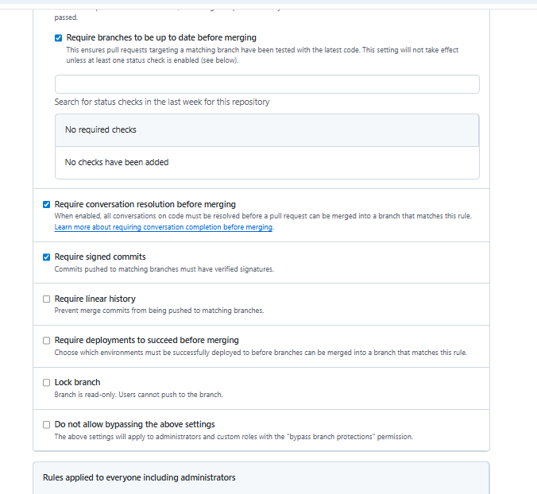
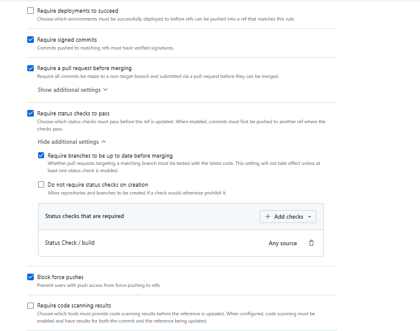

# Exercise Outcomes Submission Template

**Student/Group Name**: Asma Jaradat, "Individual - virtual mode, I have no group"
**Level Completed**: intermediate
**Date**: 01/01/2026

---

## 📋 Exercise Summary

### Exercise: Intermediate Git Exercise
**Status**: ✅ Completed

**What I did**:
I created two feature branches (`feature/header` and `feature/footer`) from the `intermediate` branch. I added different content to the same file (`page.html`) in each branch to learn about conflicts and how to resolve them when merging. Then, I merged both branches into `intermediate`, resolved the conflict by combining header and footer sections and removing the conflicting parts `=======,<<<<<<< HEAD,>>>>>>> feature/footer`, and committed the changes. Finally, I created both annotated and lightweight tags and pushed them to the remote repository.

**Commands Used**:
```bash
git checkout intermediate
git checkout -b feature/header
git checkout intermediate
git checkout -b feature/footer
# Add header in feature/header
echo "<header>Header Section</header>" > page.html
git add page.html
git commit -m "Add header to page"
# Add footer in feature/footer
 echo "<footer>Header Section</footer>" > page.html
git add page.html
git commit -m "Add Footer to page"
# Merge branches
git checkout intermediate
git merge feature/header
git merge feature/footer
# Resolve conflict
git add page.html
git commit -m "Merge footer with resolved conflicts"
# Create tags
git tag -a v1.0 -m "First stable version with merged features"
git tag
git show v1.0
git tag v1.0-test
git show v1.0-test
git show v1.0
git push origin v1.0

```

**Results/Output**:
```bash
Administrator@DESKTOP-BIJ31U3 MINGW64 ~/OneDrive - UNIVERSIDAD DE GRANADA/Desktop/DS/bloque3/taller-master-ugr (i-have-nogroup-outcomes/intermediate)
$  git log --oneline -10
c05829d (HEAD -> i-have-nogroup-outcomes/intermediate, tag: v1.0-test, tag: v1.0, intermediate) Merge footer with resolved conflicts
01dd273 (feature/footer) Add Footer to page
94670b6 (feature/header) Add header to page
994450b (origin/intermediate) refactor: consolidate intermediate exercises into single comprehensive exercise
a1c17e7 docs: Add submission instructions to intermediate level
9f25f7a Update README for intermediate level exercises
dc58203 Revert "Update README.md"
e2db1ca (tag: v0.0.1) Update README.md
3d651c3 Update README.md
4cc5635 Initial commit

**Screenshots** (if applicable):
](image-4.png)

## 🎯 Key Learnings

**Main concepts I learned**:
1. How Git handles merges and when conflicts occur.
2. Understanding conflict markers (<<<<<<<, =======, >>>>>>>) and how to resolve them.
3. Difference between annotated and lightweight tags and their use cases.

**Skills I improved**:
- Resolving merge conflicts manually.
- Creating and pushing tags to remote.
- Documenting Git workflows clearly.

---

## 🛠 Challenges Faced

### Challenge 1: Understanding conflict markers
**Problem**: At first, I was confused by the markers in the file.
**Solution**: I learned that HEAD represents my current branch, and the other section is from the branch being merged. I removed the markers and combined both changes.
**Commands/Approach**:
```bash
git add page.html
git commit -m "Merge footer with resolved conflicts"
```

### Challenge 2: Difference between tag types
**Problem**: I wasn’t sure when to use annotated vs lightweight tags.
**Solution**: Annotated tags are for official releases with metadata, while lightweight tags are simple bookmarks.

---

## 💬 Personal Reflection
What surprised me: I didn’t expect Git to show both versions of the conflicting content in the same file with clear markers. This approach makes it easier to understand what happened during the merge and gives full control to the developer to decide what to keep. It showed me how Git is designed to handle collaboration in a very transparent way.
What I found most difficult: Resolving the conflict the first time was tricky because I wasn’t sure which part belonged to which branch. Understanding the meaning of <<<<<<< HEAD, =======, and >>>>>>> branch-name took some time, but once I understood them, the process became much easier.
What I found most useful: Learning a lot about tags and their purpose for versioning was very valuable. Annotated tags are great for official releases, while lightweight tags are valueable for quick internal references.
How I would apply this in real projects: I will use annotated tags for stable releases and lightweight tags for temporary checkpoints. Conflict resolution skills will help me work effectively in teams where multiple people edit the same files.

---

## 📊 Self-Assessment
| Topic | Confidence (1-5) | Notes |
|-------|------------------|-------|
| Basic Git commands | 5 | Comfortable with basics |
| Branching & merging | 4 | Practiced multiple merges |
| Remote operations | 4 | Pushed tags and branches |
| Conflict resolution | 4 | Learned markers and resolution |
| History rewriting | 1 | Not covered yet |
| Git hooks | 1 | Not covered yet |
| Security practices | 1 | Not covered yet |

---

## 🔗 Evidence/Artifacts
**Links to branches/commits**:
- Outcome branch: https://github.com/asmajabr/taller-master-ugr/tree/i-have-nogroup-outcomes/intermediate
- Key commits:
  - c05829d (HEAD -> i-have-nogroup-outcomes/intermediate, tag: v1.0-test, tag: v1.0, intermediate) Merge footer with resolved conflicts
  - 01dd273 (feature/footer) Add Footer to page
  - 94670b6 (feature/header) Add header to page


**Additional files created**:
- OUTCOMES.md: Documented exercise results

---

**Submission Date**: 01/01/2026
**Ready for Review**: ✅ Yes
