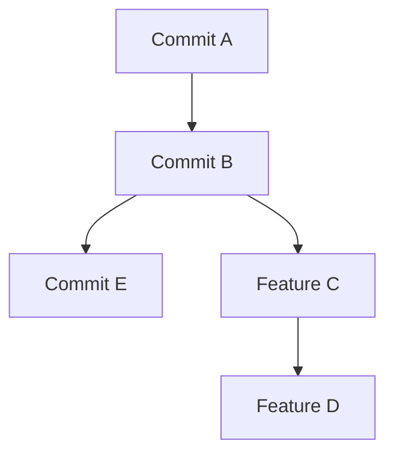

# Master Level Exercise Outcomes

**Student/Group Name**: Asma Jaradat, "Individual - virtual mode, I have no group"
**Level Completed**: Master
**Date**: 02/01/2026

---

## 📋 Exercise Summary
**Exercise**: Master Level – History Rewriting with Amend and Rebase
**Status**: ✅ Completed

---

## ✅ Part 1 – Amending Commits
### Commands Used
```bash
echo "version=1.0" > config.txt
git add config.txt
git commit -m "Add configuration file"

echo "environment=production" >> config.txt
git add config.txt
git commit --amend -m "Add complete configuration file"

git log --oneline -n 3
```

**Before & After**:
- Before amend: Two commits (initial + missing config)
- After amend: One commit with full configuration

---

## ✅ Part 2 – Interactive Rebase
### Commands Used
```bash
echo "Feature A" > featureA.txt
git add featureA.txt
git commit -m "Add feature A"

echo "Feature B" > featureB.txt
git add featureB.txt
git commit -m "Add feature B"

echo "Fix typo in A" >> featureA.txt
git add featureA.txt
git commit -m "Fix typo"

git rebase -i HEAD~3

```

**Result**:
- "Fix typo" squashed into previous commit
- "Add feature B" message reworded
- Clean history: Two commits instead of three


---

## ✅ Part 3 – Rebasing a Branch
### Commands Used
```bash
git checkout -b feature/awesome-feature
echo "Awesome Feature" > awesome.txt
git add awesome.txt
git commit -m "Add awesome feature"

git checkout master
echo "Master update" > master-update.txt
git add master-update.txt
git commit -m "Update on master branch"

git checkout feature/awesome-feature
git rebase master

git log --graph --oneline --all -n 10
```

**Result**:
- Feature branch rebased on updated master
- Linear history (no merge commit)

---

## ✅ Part 4 – Understanding Risks
- Commit SHAs changed after amend/rebase → proof of history rewrite
 When we run git commit --amend or git rebase, Git creates new commits instead of editing the old ones.
 This means the SHA identifiers change:
 proof:
  Before: 6570dce Add feature B
  After:  cec3444 Add feature B using reword
  # altough it's powerful but it's dangerous because it changes the identity of commits

- Why not rewrite public history:
      - Breaks collaboration, causes conflicts
      - If others have already pulled the old commits, rewriting them causes divergence.
      - Leads to merge conflicts, broken builds, and confusion.
- Safe workflow:
      - Rebase/amend only on private branches
      - Use: git push --force-with-lease  instead of --force for safety
      - Document the rewrites in team communication

---


**Merge vs Rebase**:

After Merge: Adds merge commit
After Rebase: C and D replayed on top of E → linear history

---

## 🗨 Personal Reflection
Working through this exercise I learned the 2 sides  power and risks of rewriting Git history. I learned how `git commit --amend` and `git rebase -i` can create a clean, professional commit log by squashing and rewording commits. The most challenging part was fixing interactive rebase errors caused by incorrect syntax and OneDrive locks. Resolving these issues helped me understand Git internals and recovery commands like `git rebase --abort` and manual cleanup of `.git/rebase-merge`.  

Rebasing a branch clarified why teams prefer linear history for clarity, but also why rewriting shared history is dangerous. I now understand the importance of using `--force-with-lease` instead of `--force` when pushing rewritten history. In real projects, I would only rebase private feature branches before pushing and always communicate changes to the team. This exercise reinforced that Git is not just about commands—it’s about collaboration, safety, and maintaining integrity in workflows.  

---

## ✅ Self-Assessment
| Topic                | Confidence (1-5) | Notes                                  |
|----------------------|-------------------|----------------------------------------|
| Amend commits        | 5                | Comfortable with `--amend`            |
| Interactive rebase   | 4                | Practiced fixup, reword, squash       |
| Rebasing branches    | 4                | Learned linear history vs merge       |
| Risk management      | 4                | Understand safe workflows             |
| Force push options   | 4                | Prefer `--force-with-lease`           |

---

## 🔗 Evidence
- Outcome branch: https://github.com/asmajabr/taller-master-ugr/tree/i-have-nogroup-outcomes/master
- Screenshots: 


✅ Ready for Review.
