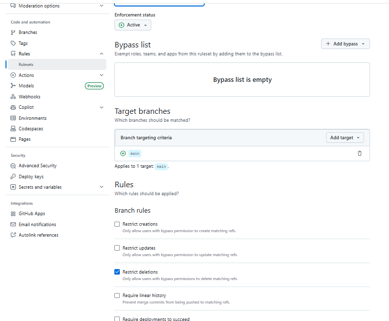
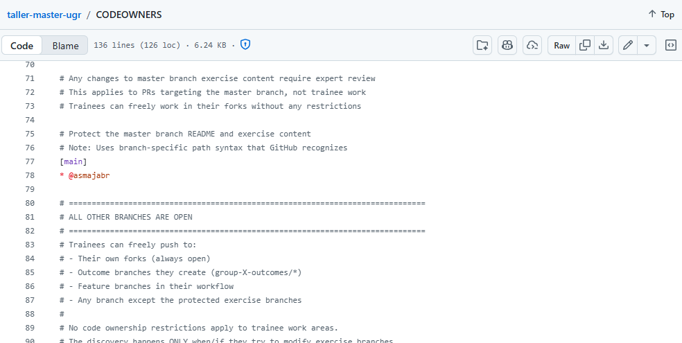
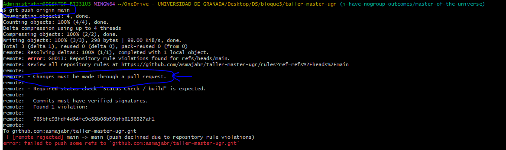
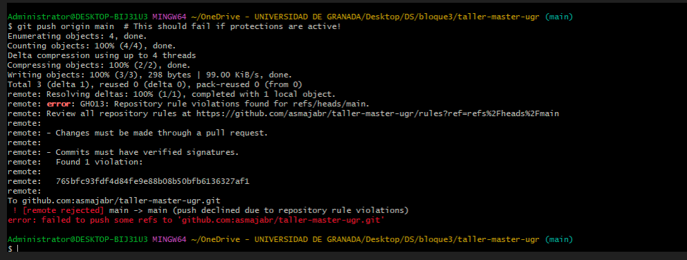
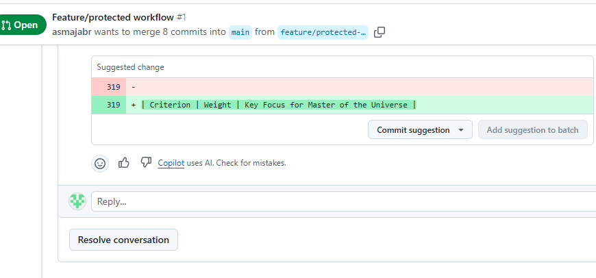
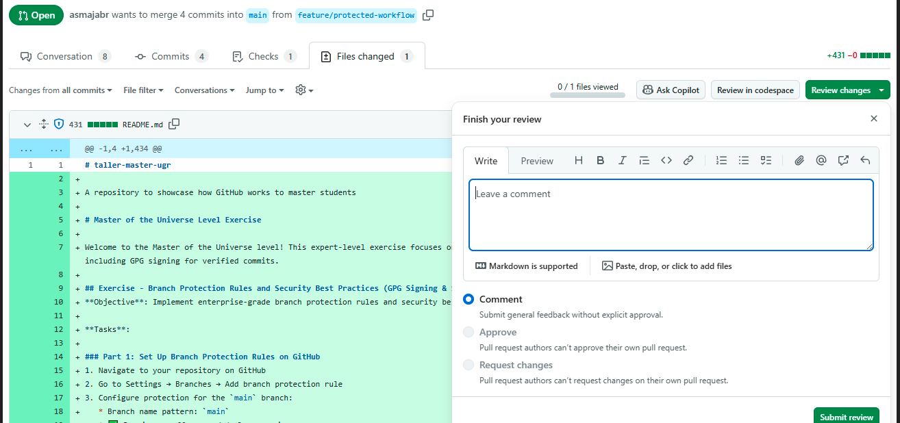
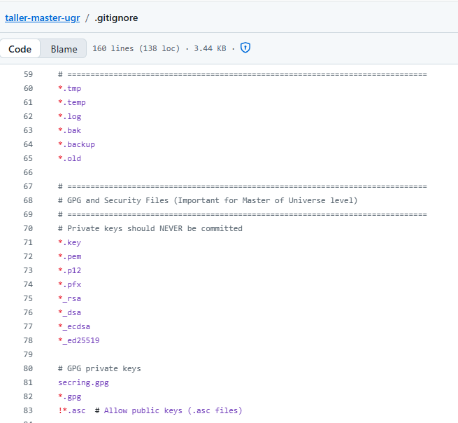
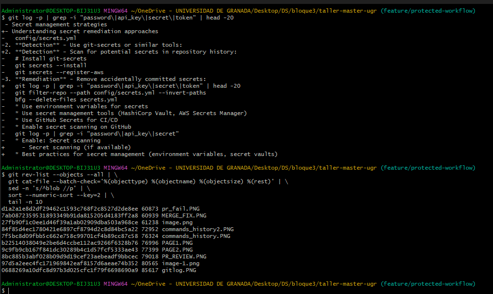
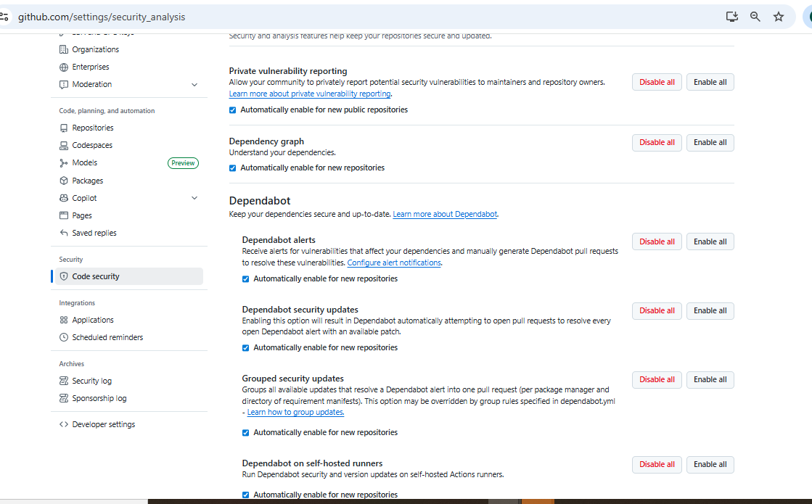

# Exercise Outcomes Submission

**Student/Group Name**: ASMA JARADAT, Individual (virtual mode, i have no group)
**Level Completed**: master-of-the-universe
**Date**: 2026-01-03

---

## 📋 Exercise Summary

### Exercise: Git Advanced Workflow & Security
**Status**: ✅ Completed

**What I did**:
Completed all parts (1–5):

## Part 1 – Branch Protection Rules
### ✅ Screenshots:
  -  **Branch Protection Settings** page showing all configured rules.
      
  -  **CODEOWNERS file** in the repository 

### Explanation of Each Rule:
- **Require a pull request before merging:** Prevents direct pushes to `main`. All changes must go through a PR for review.
- **Require approvals (at least 1):** Ensures peer review before merging.
- **Dismiss stale pull request approvals:** Invalidates old approvals after new commits.
- **Require review from Code Owners:** Enforces domain-specific review using CODEOWNERS listed in this file  (The branch protection rule “Require setting references the CODEOWNERS file when a PR modifies files , GitHub automatically requests reviews from the specified owners before merging.)
- **Require status checks to pass:** Blocks merging until CI checks succeed.
- **Require branches to be up to date:** Ensures PR branch includes latest `main` changes.
- **Require conversation resolution:** All review comments must be resolved before merging.
- **Require signed commits:** Verifies commit authorship using GPG.
- **Include administrators:** Applies rules to admins too.

### Evidence of Workflow Impact:
 - Branch protection rules enforced the following:
 - Direct pushes to `main` were blocked; changes could only be merged via a Pull Request.
 - Merge was prevented until all required conditions are met:
        • Status checks passed .
        • Commits were verified (signed).
        • Conversations resolving.


- PR required for merging.
---
## Part 2 – Protected Workflow Testing
### ✅ Screenshots:
- **blocked direct push error message** Direct push attempt blocked ().
- **Pull Request page** showing required checks and approvals. 
- **Code Owner review request**. 

### Documentation:
- Demonstrated blocked direct push using `git push origin main`.
- Created feature branch and PR workflow.
- Observed required reviews and status checks on GitHub.
- Created feature branch and PR workflow.
- Implemented GPG commit signing and verified on GitHub.
- Reviewed `.gitignore` for sensitive patterns.
- Scanned history for secrets and large files.
- accomplished security audit and documented best practices.

## Part 3 – GPG Signing Setup
### ✅ Screenshots :
-**GPG key generation output**:.
- **GitHub GPG key settings** .
-**GitHub commits showing Verified badge**.

## Part 4 – Sensitive Data Management
### ✅ Screenshots to Include:
-`.gitignore` file: it is a file in github that tells git which files it should not commit nor track (like sensitive data )
- **secret scan output**: 
- **large file scan output**: in the above screenshot

### `.gitignore` Snippet:
```text
# Ignore environment files
.env
*.pem
*.key
# Ignore credentials
*.credentials
```

### Remediation: if secrets found
- Use `git filter-repo` or BFG Repo-Cleaner.
- Rotate credentials immediately if exposed.

# Part 5 – Security Audit and Best Practices
### ✅ Screenshots:
- **GitHub security settings** (Code scanning, Dependabot alerts).

### Audit Findings:
- No secrets found.
- Largest files are screenshots I uploaded to the repository to support my documentation

### Best Practices:
- GPG signing prevents impersonation.
- Branch protection enforces secure collaboration.
- Secret management: use environment variables and vaults.

---
**All Commands I Used**:
```bash
git checkout master-of-the-universe
git checkout -b feature/protected-workflow
git add workflow.txt
git commit -S -m "feat: Add workflow documentation"
git push origin feature/protected-workflow
git checkout main
git pull origin main
echo "test" > direct-push.txt
git add direct-push.txt
git commit -m "Attempting direct push"
git push origin main  # This should fail if protections are active!
git checkout master-of-the-universe
git checkout -b feature/protected-workflow
echo "Proper workflow following branch protection" > workflow.txt
git add workflow.txt
git commit -S -m "feat: Add workflow documentation"
git push origin feature/protected-workflow
git checkout feature/protected-workflow
git log --oneline --decorate --graph --left-right --cherry-pick origin/main...HEAD
clear
gpg --full-generate-key
gpg --list-secret-keys --keyid-format=long
gpg --armor --export  F76A5FB3A01DC002A4858D6940E49CED14881D32
git config --global user.signingkey F76A5FB3A01DC002A4858D6940E49CED14881D32
git config --global commit.gpgsign true
gpg --edit-key 1C6298A4EB3B4BD5
echo "Signed commit test 1" > signed-1.txt
git add signed-1.txt
git commit -S -m "feat: Add first signed commit"
echo "Signed commit test 2" > signed-2.txt
git add signed-2.txt
git commit -S -m "feat: Add second signed commit"
git log --show-signature -2
git push origin feature/protected-workflow
git push --force-with-lease origin feature/protected-workflow
git status
git add .
git commit -m 'add print screens'
git push origin feature/protected-workflow
git fetch origin
git pull --rebase origin feature/protected-workflo
git pull --rebase origin feature/protected-workflow
git push --force-with-lease origin feature/protected-workflow
git log -p | grep -i "password\|api_key\|secret\|token"
git log -p | grep -i "password\|api_key\|secret\|token" | head -20
git rev-list --objects --all |   git cat-file --batch-check='%(objecttype) %(objectname) %(objectsize) %(rest)' |   sed -n 's/^blob //p' |   sort --numeric-sort --key=2 |   tail -n 10
git add .
git commit -m  'last commit to upload all pics to include in outcomes.md'
git push origin feature/workflow
git push origin feature/protected-workflow
git checkout master-of-the-universe
git checkout -b i-have-nogroup-outcomes/master-of-the-universe
git checkout main -- OUTCOME_TEMPLATE.md
cp OUTCOME_TEMPLATE.md OUTCOMES.md

# GPG setup
gpg --full-generate-key
gpg --list-secret-keys --keyid-format=long
gpg --armor --export F76A5FB3A01DC002A4858D6940E49CED14881D32
git config --global user.signingkey F76A5FB3A01DC002A4858D6940E49CED14881D32
git config --global commit.gpgsign true

# Signed commits
git commit -S -m "feat: Add signed commit"

# Secret detection
git log -p | grep -i "password\|api_key\|secret\|token" | head -20

# Large file scan
git rev-list --objects --all |   git cat-file --batch-check='%(objecttype) %(objectname) %(objectsize) %(rest)' |   sed -n 's/^blob //p' |   sort --numeric-sort --key=2 |   tail -n 10
```

**Results/Output**:
```text
# Secret scan result:
Matches found only in README text, no actual secrets.


# Large file scan result:
Largest files are PNG screenshots (60–85 KB), no sensitive data.

```

**Screenshots**:
- PR1.PNG: Branch protection settings
- PR2.PNG: Pull Request creation
- PR_REVIEW.PNG: Review required
- PR_MERGE.PNG: Successful merge
- gitlog.PNG: Verified commits
- GitHub security settings screenshot

---

## 🎯 Key Learnings
**Main concepts I learned**:
1. How branch protection enforces secure workflows.
2. Secret management strategies and GitHub security features.
3. Why GPG signing prevents impersonation.

**Skills I improved**:
- Configuring secure Git workflows.
- Using GPG for commit signing.
- Auditing repositories for sensitive data.

---

## 🚧 Challenges Faced
### Challenge 1: Push rejected due to remote changes
**Problem**: Remote branch had commits I didn’t have locally (due to the pull request I tried from that branch to to main)
**Solution**: Used `git fetch` and `git pull --rebase` to integrate changes and pushed using --force-with-lease
**Commands**:
```bash
git fetch origin
git pull --rebase origin feature/protected-workflow
git push --force-with-lease origin feature/protected-workflow

```

### Challenge 2: SSH and GPG setup
**Problem**: Initial SSH key not loaded, GPG key not recognized.
**Solution**: Started ssh-agent, added key, configured GPG signing.

---

## 💬 Personal Reflection
**What surprised me**: How strict branch protection and signed commits are in enterprise workflows.
**What I found most difficult**: Resolving push rejections and configuring GPG correctly.
**What I found most useful**: Verified badge and GitHub security features.
**How I would apply this in real projects**: Enforce signed commits, branch protection, and secret scanning in CI/CD pipelines.
Commit verification is critical in enterprise environments because it ensures authenticity and integrity of code contributions. In large teams, unsigned commits can lead to impersonation risks or undetected tampering, which could compromise the entire software supply chain. By enforcing GPG signing, organizations create a cryptographic trust layer that validates every change before it enters production. This practice aligns with compliance requirements and builds confidence in collaborative development.

Branch protection rules complement this by preventing direct pushes to critical branches like `main`. They enforce peer reviews, status checks, and signed commits, reducing the likelihood of introducing vulnerabilities or unstable code. These rules ensure that every change undergoes scrutiny and automated testing before merging. and this is what i learned in this exercise

Secret management is another pilar of secure development. Hardcoding credentials in repositories is dangerous mistake. Even if removed later, secrets remain in history and can be exploited. My strategy involves using environment variables, secret vaults such as HashiCorp Vault or AWS Secrets Manager, and GitHub Actions secrets for CI/CD pipelines. If exposure occurs, rotating credentials immediately is more effective than relying solely on history cleanup.

Implementing these practices in real projects requires balancing security with development velocity. While strict rules may slow down merges, they significantly reduce risk. Integrating these measures into DevSecOps pipelines ensures security is automated and continuous, rather than an afterthought. Tools like Dependabot, secret scanning, and code scanning further strengthen defenses. Ultimately, these practices transform security from a bottleneck into a shared responsibility, enabling teams to deliver high-quality, secure software at scale.

---

## 📊 Self-Assessment
| Topic | Confidence (1-5) | Notes |
|-------|------------------|-------|
| Basic Git commands | 5 | Confident |
| Branching & merging | 5 | Confident |
| Remote operations | 5 | Confident |
| Conflict resolution | 4 | Learned rebase |
| History rewriting | 4 | Understand filter-repo |
| Git hooks | 3 | Basic knowledge |
| Security practices | 5 | GPG, secret scanning |

---

## 🔗 Evidence/Artifacts
- Branch: https://github.com/asmajabr/taller-master-ugr/tree/i-have-nogroup-outcomes/master-of-the-universe
- Key commits: Signed commits with Verified badge
- Additional files: OUTCOMES.md, screenshots

---

## ✅ Completion Checklist
- [✅] Completed all parts
- [✅] Documented commands and outputs
- [✅] Added screenshots
- [✅] Reflection and self-assessment
- [✅] Pushed outcome branch

---

## 📝 Additional Comments
This exercise was challenging but valuable for mastering secure Git workflows.

**Submission Date**: 2026-01-03
**Ready for Review**: ✅ Yes
