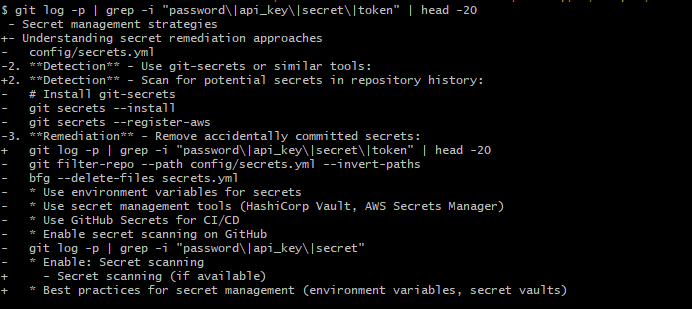
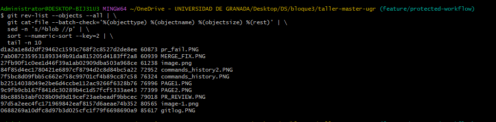
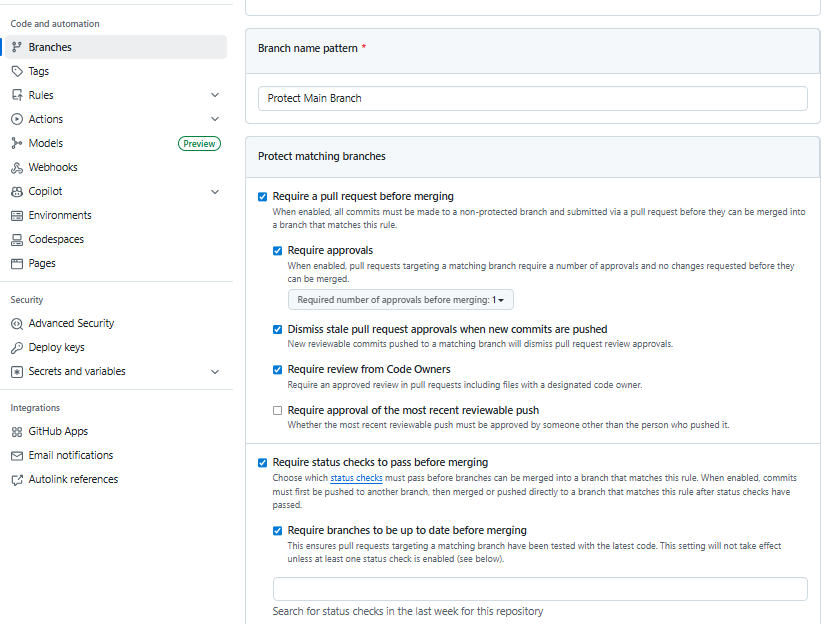

# Exercise Outcomes Submission Template

**Student/Group Name**: [Asma Jaradat - no group (individual)]  
**Level Completed**: [newbie]  
**Date**: [01/01/2026]

---

## 📋 Exercise Summary

### Exercise: [complete excercise 1 newbie level]
**Status**: ✅ Completed

**What I did**:
I reconfigured Git ( I had it configured before but in this assignment i reset the settings and started from scratch), I cloned the repository using SSH, created and committed files, explored `git status` and `git log`, created the feature branch, added the personal info, pushed the branch to my fork, and prepared the results documentation.

**Commands Used**:
```bash
# List the key Git commands you used across all parts of the exercise
#git config
git config --global user.name "ASMA JARADAT"
git config --global user.email "asmajabr@gmail.com"
# configure ssh
ssh-keygen -t ed25519 -C "asmajabr@gmail.com"
mkdir -p ~/.ssh
mv gitsshkey ~/.ssh/
mv gitsshkey.pub ~/.ssh/
ssh-add ~/.ssh/gitsshkey
$ ssh -T git@github.com
#clone repo
git clone git@github.com:miguel-oltra/taller-master-ugr.git
cd taller-master-ugr
git checkout newbie
git branch
echo 'ASMA JARADAT' > hello.txt
git status
git add hello.txt
git commit -m 'Add my name to hello.txt'
git log
git log --oneline
git branch feature/my-info
git checkout feature/my-info
echo "Name: Asma Jaradat
Favorite Language: Python
Why I'm learning Git: To master version control for projects and excel at my work as a devops" > my-info.txt
git add my-info.txt
git commit -m 'Add personal information'
git remote add upstream git@github.com:miguel-oltra/taller-master-ugr.git
git remote -v
git fetch upstream
git branch -a
git checkout -b newbie upstream/newbie
git checkout -b intermediate upstream/intermediate
git checkout -b intermediate upstream/master
git checkout -b intermediate upstream/master-of-the-universe
git branch
git checkout -b master-of-the-universe upstream/master-of-the-universe
git checkout -b master upstream/master
git branch
git push origen newbie
git push origin newbie
git push origin intermediate
git push origin master
git push origin master-of-the-universe
git checkout newbie
git pull origin newbie
git checkout -outcomes/newbie
git checkout outcomes/newbie
git checkout -b -outcomes/newbie
git checkout -b i-have-nogroup-outcomes/newbie
git checkout main -- OUTCOME_TEMPLATE.md
cp OUTCOME_TEMPLATE.md OUTCOMES.md


```

**Results/Output**:
```
$ ssh-keygen -t ed25519 -C "asmajabr@gmail.com"
Generating public/private ed25519 key pair.
Enter file in which to save the key (/c/Users/Administrator/.ssh/id_ed25519): gitsshkey
Enter passphrase for "gitsshkey" (empty for no passphrase):
Enter same passphrase again:
Your identification has been saved in gitsshkey
Your public key has been saved in gitsshkey.pub
The key fingerprint is:
SHA256:pOnlTfxzTLrt2KxRJnizRETKC1F/RCB9kHatblhgqNc asmajabr@gmail.com
The key's randomart image is:
+--[ED25519 256]--+
|        ..o+==o. |
|         o.=*.o .|
|        o.o+o+.. |
|       +.o.+E.o  |
|      o S.= =++  |
|     . o o +.Xo  |
|      . . . *.o  |
|             X   |
|            +o=  |
+----[SHA256]-----+


$ ssh -T git@github.com
Hi asmajabr! You've successfully authenticated, but GitHub does not provide shell access.

$ git clone git@github.com:miguel-oltra/taller-master-ugr.git
Cloning into 'taller-master-ugr'...
remote: Enumerating objects: 97, done.
remote: Counting objects: 100% (8/8), done.
remote: Compressing objects: 100% (6/6), done.
remote: Total 97 (delta 2), reused 2 (delta 2), pack-reused 89 (from 1)
Receiving objects: 100% (97/97), 66.45 KiB | 1.13 MiB/s, done.
Resolving deltas: 100% (33/33), done.

$ git checkout newbie
branch 'newbie' set up to track 'origin/newbie'.
Switched to a new branch 'newbie'


$ git log --oneline
116b914 (HEAD -> newbie) Add my name to hello.txt
360f4a4 (origin/newbie) refactor: consolidate newbie exercises into single comprehensive exercise
5eedc97 docs: Add submission instructions to newbie level
45e1c31 Update README for newbie level exercises
dc58203 Revert "Update README.md"
e2db1ca (tag: v0.0.1) Update README.md
3d651c3 Update README.md
4cc5635 Initial commit


# set the original repo ( cannot push to it as an upstream and my forked branch as the origin to push to)
git remote add upstream git@github.com:miguel-oltra/taller-master-ugr.git
git remote -v
origin  git@github.com:asmajabr/taller-master-ugr.git (fetch)
origin  git@github.com:asmajabr/taller-master-ugr.git (push)
upstream        git@github.com:miguel-oltra/taller-master-ugr.git (fetch)
upstream        git@github.com:miguel-oltra/taller-master-ugr.git (push)

Administrator@DESKTOP-BIJ31U3 MINGW64 ~/OneDrive - UNIVERSIDAD DE GRANADA/Desktop/DS/bloque3/taller-master-ugr (feature/my-info)
$ git fetch upstream
hostfile_replace_entries: link /c/Users/Administrator/.ssh/known_hosts to /c/Users/Administrator/.ssh/known_hosts.old: Permission denied
update_known_hosts: hostfile_replace_entries failed for /c/Users/Administrator/.ssh/known_hosts: Permission denied
From github.com:miguel-oltra/taller-master-ugr
 * [new branch]      intermediate           -> upstream/intermediate
 * [new branch]      main                   -> upstream/main
 * [new branch]      master                 -> upstream/master
 * [new branch]      master-of-the-universe -> upstream/master-of-the-universe
 * [new branch]      newbie                 -> upstream/newbie
##
then I pushed all branches to my forked repo
$ git branch -a
* feature/my-info
  main
  newbie
  remotes/origin/HEAD -> origin/main
  remotes/origin/feature/my-info
  remotes/origin/intermediate
  remotes/origin/main
  remotes/origin/master
  remotes/origin/master-of-the-universe
  remotes/origin/newbie
  remotes/upstream/HEAD -> upstream/main
  remotes/upstream/intermediate
  remotes/upstream/main
  remotes/upstream/master
  remotes/upstream/master-of-the-universe
  remotes/upstream/newbie

Administrator@DESKTOP-BIJ31U3 MINGW64 ~/OneDrive - UNIVERSIDAD DE GRANADA/Desktop/DS/bloque3/taller-master-ugr (feature/my-info)
$
git checkout -b intermediate upstream/intermediate
fatal: a branch named 'newbie' already exists
branch 'intermediate' set up to track 'upstream/intermediate'.
Switched to a new branch 'intermediate'
$ git checkout -b master upstream/master
branch 'master' set up to track 'upstream/master'.
Switched to a new branch 'master'
# did for all the rest and then pushed them to my fork
$ git push origin newbie
$ git push origin intermediate
$ git push origin master
$ git push origin master-of-the-universe
##############
create the new branch with outcomes and filled the template
$ git checkout -b i-have-nogroup-outcomes/newbie
Switched to a new branch 'i-have-nogroup-outcomes/newbie'

Administrator@DESKTOP-BIJ31U3 MINGW64 ~/OneDrive - UNIVERSIDAD DE GRANADA/Desktop/DS/bloque3/taller-master-ugr (i-have-nogroup-outcomes/newbie)
$ git checkout main -- OUTCOME_TEMPLATE.md

Administrator@DESKTOP-BIJ31U3 MINGW64 ~/OneDrive - UNIVERSIDAD DE GRANADA/Desktop/DS/bloque3/taller-master-ugr (i-have-nogroup-outcomes/newbie)
$ cp OUTCOME_TEMPLATE.md OUTCOMES.md

Administrator@DESKTOP-BIJ31U3 MINGW64 ~/OneDrive - UNIVERSIDAD DE GRANADA/Desktop/DS/bloque3/taller-master-ugr (i-have-nogroup-outcomes/newbie)

```

**Screenshots** (if applicable):
 

---

## 🎯 Key Learnings

**Main concepts I learned**:

The difference between staging and committing
How to create, switch, and push branches
upstream and origin repos


**Skills I improved**:

Reading and understanding Git logs
Managing SSH keys for GitHub
Working with remote repositories


---

## 🚧 Challenges Faced

### Challenge 1: [SSH permission denied ]
**Problem**: [could not push to the original repo]

**Solution**: [forked the original repo and set it as the upstream to fetch from then set my forked repo as the origin and pushed to it,i did this because i already forked it from github and it only contained one branch the main ,so my fork was not complete so i sat the original repo for the fetch and mine for the push]

**Commands/Approach**:
```bash
# Commands or approach used to solve the problem
```
$ git remote set-url origin git@github.com:asmajabr/taller-master-ugr.git
$git remote add upstream git@github.com:miguel-oltra/taller-master-ugr.git
git remote -v
origin  git@github.com:asmajabr/taller-master-ugr.git (fetch)
origin  git@github.com:asmajabr/taller-master-ugr.git (push)
upstream        git@github.com:miguel-oltra/taller-master-ugr.git (fetch)
upstream        git@github.com:miguel-oltra/taller-master-ugr.git (push)
$ git fetch upstream
hostfile_replace_entries: link /c/Users/Administrator/.ssh/known_hosts to /c/Users/Administrator/.ssh/known_hosts.old: Permission denied
update_known_hosts: hostfile_replace_entries failed for /c/Users/Administrator/.ssh/known_hosts: Permission denied
From github.com:miguel-oltra/taller-master-ugr
 * [new branch]      intermediate           -> upstream/intermediate
 * [new branch]      main                   -> upstream/main
 * [new branch]      master                 -> upstream/master
 * [new branch]      master-of-the-universe -> upstream/master-of-the-universe
 * [new branch]      newbie                 -> upstream/newbie


---

### Challenge 2: [Challenge 2: Pager stuck on git log]
**Problem**: [git log opened in pager and I couldn’t exit.]

**Solution**: [ Pressed q to quit pager and used git log --oneline]

---

## 💭 Personal Reflection

**What surprised me**:
[Git uses a three-tree architecture (working dir, staging, repo)]

**What I found most difficult**:
[SSH setup and OneDrive interfering with .ssh folder.]

**What I found most useful**:
[ Branching and remote operations for team work.]

**How I would apply this in real projects**:
[Use feature branches for isolated development and PRs for code review.]

---

## 📊 Self-Assessment

Rate your confidence level for each topic (1-5, where 5 is very confident):

| Topic | Confidence (1-5) | Notes |
|-------|------------------|-------|
| Basic Git commands | [4 ] | |
| Branching & merging | [4 ] | |
| Remote operations | [4 ] | |
| Conflict resolution | [ 1] | | not covered yet and i haven't faced any conflicts yet
| History rewriting | [1 ] | | not covered yet
| Git hooks | [ 1] | | not covered yet
| Security practices | [1 ] | | not convered yet

---

## 🔗 Evidence/Artifacts

**Links to branches/commits**:
- Link to your outcome branch: `https://github.com/asmajabr/taller-master-ugr/tree/i-have-nogroup-outcomes/newbie`
- Key commits demonstrating your work:

  d8f6eab (HEAD -> i-have-nogroup-outcomes/newbie, origin/i-have-nogroup-outcomes/newbie) add all
  d2b9ca7 Add newbie level exercise outcomes
  116b914 (origin/newbie, newbie) Add my name to hello.txt
  360f4a4 (upstream/newbie) refactor: consolidate newbie exercises into single comprehensive exercise
  5eedc97 docs: Add submission instructions to newbie level
  45e1c31 Update README for newbie level exercises
  dc58203 Revert "Update README.md"
  e2db1ca (tag: v0.0.1) Update README.md
  3d651c3 Update README.md
  4cc5635 Initial commit


**Additional files created** (if any):
- image.png: [screenshot]
- image-1.png: [screenshot]
- image-2.png: [screenshot]


---

## ✅ Completion Checklist

Before submitting, ensure you have:
- [✅] Completed the exercise for your chosen level (including all parts)
- [✅] Documented all commands used with their outputs
- [✅] Described challenges and how you resolved them
- [✅] Provided a thoughtful reflection on your learning
- [✅] Self-assessed your confidence in each topic
- [✅] Pushed your outcome branch to the remote repository
- [✅] Created a Pull Request (if required by your instructor)

---

## 📝 Additional Comments

[Any additional thoughts, questions, or feedback about the exercises]

---

**Submission Date**: [Date]  
**Ready for Review**: ✅ Yes / ❌ No
